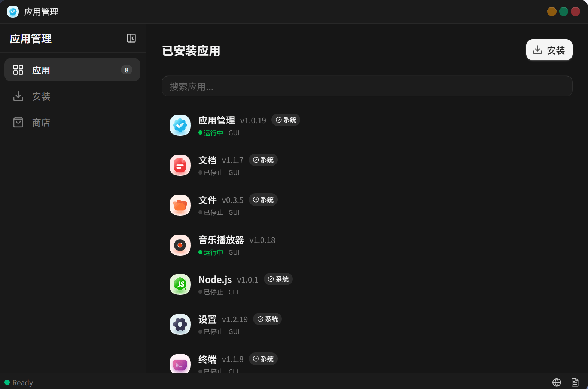

# dev.jsos.appmanager

> 应用管理 — 管理系统中的应用



安装、卸载、查看应用详情，支持桌面小组件管理。

## 功能

- 应用列表浏览与搜索
- 应用详情查看
- ZIP 安装包安装应用
- 卸载应用（可选清理数据）
- 添加桌面小组件

## 开发

```bash
npm install
npm run dev
```

## 构建

```bash
npm run build
```

## 技术栈

- React 19
- Vite 6
- Tailwind CSS v4
